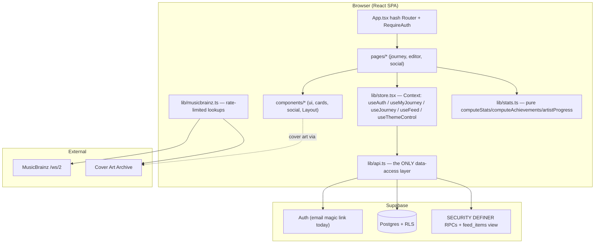
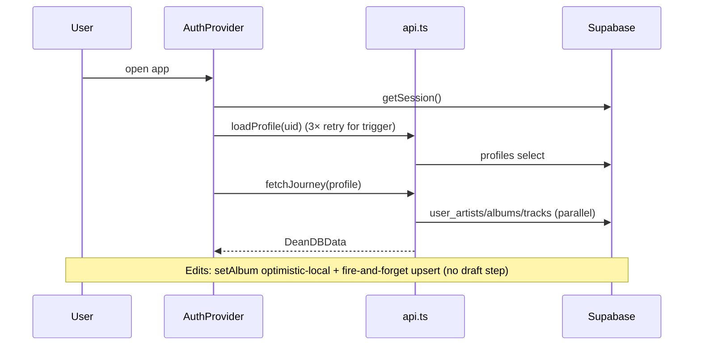

# Codebase Map

> Auto-generated by Cartographer. Last mapped: 2026-06-03.
> DeanDB is a **client-only React 18 + TS + Vite SPA** backed entirely by **Supabase** (Postgres + Auth + RLS + RPCs).
> No custom server. Deploys as static files to GitHub Pages at base path `/DeanDB/` with hash routing.

## System Overview



**Keystone:** `DeanDBData` (`src/types.ts`) is the single in-memory view model. The DB is normalized;
`api.ts:fetchJourney(profile)` reassembles a user's `user_artists/user_albums/user_tracks` rows (joined to the shared
`catalog_*`) back into one `DeanDBData`. All display pages and **all of `stats.ts`** consume that shape — keep it stable
or stats/achievements drift.

## Directory Structure

```
src/
  main.tsx              Root mount: <StrictMode><AuthProvider><App/>
  App.tsx               Hash-route switch; RequireAuth gating; #/u/:username → Profile (default export)
  types.ts              DeanDBData view model + Profile/FeedItem/Recommendation/… (the canonical shapes)
  index.css             Tailwind v4 @theme tokens (ink/panel/edge/gold/dean) + keyframes; NO tailwind.config
  lib/
    config.ts           SUPABASE_URL / SUPABASE_ANON_KEY (anon key public by design; RLS is the safety)
    supabase.ts         Client singleton; flowType "implicit"; detectSessionInUrl; authRedirectTo() (no #!)
    api.ts              ALL reads/writes: auth, profiles, fetchJourney reassembly, catalog RPCs, mutations, feed, recs
    store.tsx           Context providers/hooks; AuthProvider→ThemeProvider→AutoMeterName→MyJourneyProvider
    stats.ts            Pure: computeStats, computeAchievements (10 public+5 hidden), artistProgress, flattenAlbums
    musicbrainz.ts      Serial ~1 req/s limiter; lookupArtist/findAlbumCover/fetchTracklist/refreshArtistMeta
    themes.ts           Theme tokens, PRESETS, resolveTheme, legible()/contrast math, applyTheme (writes CSS vars)
    router.ts           Hash router: useHashRoute, navigate, parseRoute, parseUserRoute, profilePath
    format.ts           fmtHours/fmtMinutes/fmtDate/gradient/slugify/firstWord/uid
  components/
    Layout.tsx          Header (Logo, NavButton, marathon ticker, UserMenu), footer; Recs unread badge
    ui.tsx              DeanMeter, Score10, StatusBadge, LoggedBadge, ProgressBar, Panel, SectionTitle, scoreColor
    cards.tsx           Cover (gradient/art), AlbumCard, ArtistCard (basePath-aware)
    social.tsx          Avatar, PersonRow, FollowButton, RecommendModal
    NextSpinner.tsx     "Marathon Wheel" — spins eligible artists to pick the next one
    JourneyNav.tsx      Overview/Artists/Hall-of-Fame tab bar (shown when artists>0)
    EmptyState.tsx      Own-journey blank slate → Editor CTA
  pages/
    Dashboard|Artists|ArtistDetail|AlbumDetail|HallOfFame   read-only journey views (props: data, basePath, canEdit)
    Editor.tsx          Own-journey mission control: add/import artists, rate/review, filters toolbar, per-artist actions
    Profile.tsx         #/u/:username shell → useJourney → renders read-only pages with owner theme override
    Settings.tsx        Profile fields + visibility + theme picker + share link
    Login.tsx           Magic-link email sign-in
    Feed.tsx            Activity from accepted followees
    People.tsx          Search + follow + accept requests + following list
    Recommendations.tsx Recommendation inbox (auto-marks read on mount)
supabase/migrations/    init (schema, RLS, RPCs, feed view, legacy migrate) + dedup fix + follow-lists RPCs + personalization
.github/workflows/deploy.yml   npm ci + build + deploy dist/ to Pages on push to main
vite.config.ts          base "/DeanDB/" in build, "/" in dev
```

## Module Guide

### Data access — `lib/api.ts`
**Entry point** for everything that touches Supabase; components/pages MUST go through it.
- `fetchJourney(profile)` — 3 parallel queries → reassembles `DeanDBData`; per-user `color`/`minutes`/`rating` overlay catalog rows.
- Catalog writes only via SECURITY DEFINER RPCs (`upsert_catalog_*`, `setCatalogTracks`, `remove_user_artist`).
- Import: `importArtistFromMatch` (catalog upsert → roster add → `addUserAlbumIfMissing` per album, `ignoreDuplicates`).
- Feed: `fetchFeed(userId)` resolves accepted followees, queries the `feed_items` view `.in(user_id, followees)`.
- **Seeds `runtimeMin`/`minutes` to `40` on import** (`createUserAlbum`, `importArtistFromMatch`) — see Gotchas.

### State — `lib/store.tsx`
Provider nest: `AuthProvider → ThemeProvider → AutoMeterName → MyJourneyProvider`.
- `useAuth()` — session/profile, `signIn(email)`, `signOut`, `updateProfile` (owns `onAuthStateChange`; 3× retry for the signup-trigger race).
- `useMyJourney()` — own `DeanDBData` + `setAlbum/setTrack/setArtist` (optimistic `structuredClone` + fire-and-forget), `patchLocal`, `reload`.
- `useJourney(username)` — read-only any user; client visibility check mirrors `can_view_journey`; own username reuses live copy + `canEdit:true`.
- `useThemeControl().setThemeOverride` — used by Profile to paint another user's accent.

### Computation — `lib/stats.ts` (pure, no side effects)
- **Marathon scope** (`logged===false`): hours, goal (= total tracked runtime), `goalPct`, `artistsConquered`.
- **Collection scope** (all): completed count, ratings, songs, `topGenre`.
- `artistProgress(artist)` = completed / `max(catalogSize - excludedCount, tracked.length, 1)`.
- `computeAchievements` returns 10 public + 5 `hidden` (masked "???" until earned).

### External data — `lib/musicbrainz.ts`
Module-level serial queue, `MIN_INTERVAL_MS=1100`, 4× retry on 503/429. `lookupArtist` → search → detail → `release-group?artist=&type=album` then **client-side** filters out secondary-typed (live/comp) groups. Cover Art Archive URLs go straight into `` (no CORS, not rate-limited).

### Theming — `lib/themes.ts` + `index.css`
`@theme` defaults in CSS; `applyTheme(theme)` overrides `--color-gold/-soft/-dean` on `document.documentElement`. Every color passes `legible()` (lightens until ≥ contrast vs `#15151a`). DB `CHECK` + JS `isHexColor` = defense-in-depth against CSS injection.

### UI atoms — `components/ui.tsx`, `cards.tsx`, `social.tsx`
Reuse these rather than re-rolling: `Panel`, `SectionTitle`, `DeanMeter`, `Score10`, `StatusBadge`, `LoggedBadge`, `ProgressBar`; `Cover`, `AlbumCard`, `ArtistCard`; `Avatar`, `PersonRow`, `FollowButton`, `RecommendModal`. `basePath` is threaded so the same component links under `#/me` vs `#/u/:username`.

## Data Flow



**Visibility gate (single source):** `can_view_journey(owner)` = `owner = auth.uid() OR profile public OR accepted-follow`.
Used by every per-user table SELECT policy and the `profiles` read policy. The `feed_items` view is `security_invoker`,
so it runs under the caller's RLS — private users never leak into others' feeds.

## Conventions
- **Styling:** Tailwind v4 utilities inline + `@theme` tokens (`ink/panel/panel-2/edge/gold/gold-soft/dean`, `display` font). Reuse the atoms above.
- **Imports:** `import type { … }` for type-only (isolatedModules); relative paths only.
- **Components:** named-export function components, inline-typed props; `App.tsx` is the only default export.
- **MusicBrainz:** every request funnels through the serial limiter — never bypass it.
- **No publish/draft:** every edit persists immediately under the user's session.
- **Build gate:** `npm run typecheck` / `npm run build` (no test runner, no ESLint/Prettier). `noUnusedLocals`/`noUnusedParameters` fail the build.

## Gotchas
- **`40`-minute runtime seed** (`api.ts`): imported albums seed `minutes=40`; reassembly `ur.minutes || cat.runtime_min` lets the truthy 40 shadow real runtime → breaks the Endurance achievement and understates goal-hours. (Active fix in progress — see plan §A1.)
- **Journey % denominator** (`stats.ts`/`cards.tsx`/`ArtistDetail`): uses `catalogSize`, which never decrements when a user removes an album → progress like 6/10 instead of 6/6. (Fix in progress — plan §A2.)
- **Empty albums:** `-secondarytype:*` / `type=album` does NOT exclude `primary=Album` release-groups that simply have no tracklist (junk/bootleg) — needs a trackless filter (plan §A3).
- **`upsert_catalog_tracks` does DELETE+re-INSERT** — re-pulling a tracklist orphans any `user_tracks` ratings on that album (cascade). Editor warns before bulk track loads.
- **`feed_items` view:** new columns MUST be appended (CREATE OR REPLACE VIEW can't reorder) — reordering silently breaks idempotent re-runs.
- **`authRedirectTo()` must have no `#` fragment** or the magic-link token won't attach.
- **`loadAllTracks` silently prunes** "pristine" want/unrated albums with no MB tracklist — a silent structural mutation.
- **Follow security invariant:** a BEFORE-INSERT trigger forces `pending` for private targets; only the followee flips `pending→accepted`. Don't weaken (`init.sql`).
- **`migrate_deandb_state`** is operator-only (execute revoked from anon/authenticated).

## Navigation Guide
- **Add/modify a data read or write** → `src/lib/api.ts` (+ a migration in `supabase/migrations/` if schema/RLS/RPC changes).
- **Change journey math / a stat / an achievement** → `src/lib/stats.ts` (consumers: Dashboard, cards, Artists sort, NextSpinner).
- **Touch auth/session** → `src/lib/supabase.ts` + `src/lib/store.tsx` (`useAuth`) + `src/pages/Login.tsx` + `RequireAuth` in `App.tsx`.
- **Add a route** → `src/App.tsx` `Router`/`MyJourney` switch + `src/lib/router.ts`.
- **Add/restyle a reusable control** → `src/components/ui.tsx` (atoms) — reuse before re-rolling.
- **Editor roster (filters, per-artist actions, import)** → `src/pages/Editor.tsx`.
- **Theming / profile accent** → `src/lib/themes.ts` + `src/lib/store.tsx` (ThemeProvider) + `src/pages/Profile.tsx` (override) + `src/pages/Settings.tsx` (picker).
- **Feed content/shape** → `src/pages/Feed.tsx` + `feed_items` view (migration) + `api.ts:fetchFeed`.
- **MusicBrainz query/import** → `src/lib/musicbrainz.ts` (+ Editor import flow).
- **Build/deploy/base path** → `vite.config.ts`, `.github/workflows/deploy.yml`.
